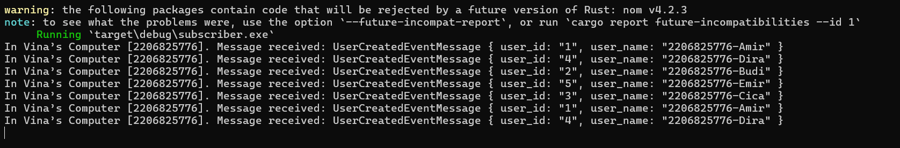

# Tutorial 8 (SUBSCRIBER)
Nama: Vina Myrnauli Abigail Siallagan 
NPM: 2206825776 
Kelas: Pemrograman Lanjut - A 

---
## REFLEKSI 1

###### 1. what is amqp?
* AMQP, yang merupakan singkatan dari Advanced Message Queuing Protocol, adalah sebuah protokol standar yang digunakan dalam lapisan aplikasi untuk middleware yang berorientasi pada pesan. 
* Biasanya, protokol ini digunakan untuk membangun sistem pengiriman pesan. Dengan menggunakan AMQP, berbagai jenis aplikasi dapat saling berkomunikasi dengan efisien dengan melakukan pertukaran pesan.

###### 2. what it means? guest:guest@localhost:5672, what is the first quest, and what is the second guest, and what is localhost:5672 is for? 
* `guest:guest@localhost:5672` adlaah string koneksi untuk sebuah server AMQP. `guest:guest` adalah kombinasi nama pengguna dan kata sandi default untuk autentikasi pada server. Di sini, baik nama pengguna maupun kata sandinya adalah 'guest'. Pada banyak konfigurasi standar broker pesan seperti RabbitMQ, nama pengguna dan kata sandi defaultnya juga 'guest'. Namun, di lingkungan produksi, disarankan untuk mengubah kredensial default ini karena pertimbangan keamanan.
* `@localhost:5672` menunjukkan alamat host dan port yang digunakan. Istilah 'localhost' merujuk pada komputer lokal, yang berarti bahwa message broker (RabbitMQ) berjalan di komputer yang sama di mana kode ini dieksekusi. Port 5672 adalah port default yang digunakan oleh RabbitMQ untuk melakukan komunikasi menggunakan protokol AMQP.

###### 3. Simulation slow subscriber
Screenshot antarmuka RabbitMQ yang di mana Queue-nya mencapai 20. Hal ini disebabkan karena saya menjalankan `cargo run` sebanyak 6 kali sehingga terjadi queue sebanyak 5 cargo run. Jadi, 1 cargo run itu mengirimkan sebanyak 4 data sehingga terdapat queue sebanyak 20 data. 

###### 4. Running at least three subscribers
* Screenshot menjalankan `cargo run` sebanyak 3 kali di console yang perbeda pada subscriber.

* Screenshot menjalankan `cargo run` sebanyak 4 kali pada publisher.

* Screenshot hasil spike dari message queue berkurang yang menunjukkan peningkatan kecepatan dari sebelumnya karena request yang diterima queue dapat dibagi kepada 3 subscriber.

###### 5. Code repair
* Menghindari pemakaian `unwrap()` karena dalam production code, penggunaannya dapat menyebabkan panic jika ada error pada result. Lebih baik menggunakan match atau if let sebagai penanganan kesalahan ini agar lebih elegan dan terkontrol.

* Selain itu untuk alternatifnya, kita dapat mendefinisikan string yang sering digunakan sebagai konstanta pada awal file sehingga dapat membuat kode lebih terbaca, terstruktur, dan menghindari iterasi yang tidak perlu.